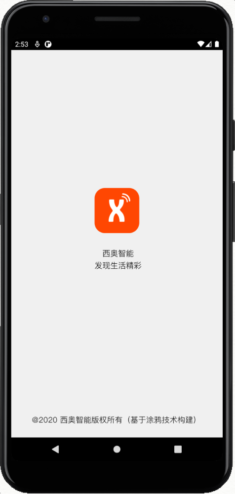
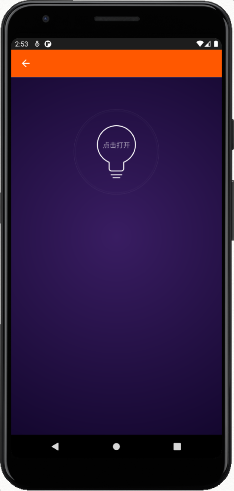
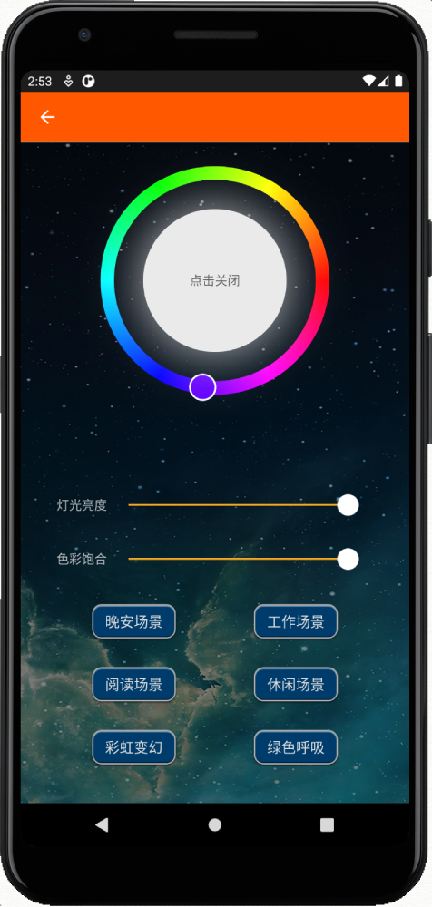

### 涂鸦 Android APP 实战营项目
项目基于涂鸦 Android APP SDK 构建，参考了涂鸦SDK自带的Demo工程。使用Android Studio打开TairraosHome目录作为app项目的根目录即可二次开发（继续开发）。  
由于安全原因，没有上传 AndroidManifest.xml 和安全图片。需要的同学请至[涂鸦AndroidSDK](https://github.com/tuya/tuya-home-android-sdk)获取模板。
请在此页面下载Release包测试： [Github Release Page](https://github.com/Tairraos/tuyaCamp-AndroidSDK/releases/tag/0.1)

### 界面截图
   

### 项目说明
- 由于APP实战营时间较紧，我没有Android开发经验，一开就把目标锁定在熟悉产品控制代码和编写美观UI两个焦点
- 通过读 Lamp demo 基本把目标所需要的知识都看会了
- 代码里没有对标准DP command调用，龙马表示这是隐藏小怪兽，也已经挖掘成功
- Color picket, Seekbar的布局沿用了Lamp demo的设计
- 美观：重新画了图标，开机页面（简单替换图片）
- 美观：关灯状态为墨蓝背景，开灯后加了星空背景
- 美观：开关灯的提示信息放在灯泡图案内部，更加美观
- 功能：添加了一组6个快捷按钮可以快速速发出6种灯光功能（其中有4个通过SDK封装的场景调用实现，有2通过标准DP命令调用实现）

### 学习所得 （Android App)
- 开发环境配置
- Build 带签名的APK
- 模拟器调试，真机调试，Release APK安装
- 使用ABI接口，ADB调试
- 熟悉了Tuya Android SDK
- 熟悉了封装的DP功能和标准DP命令
- 熟悉了照明品类的DP点定义
- Android本地化
- XML UI Layout

### 心得
- 涂鸦 Android APP SDK自带Demo已经完成了注册，登录，配网，智能化的大部分代码
- SDK对DP直接调用的封装使开发代码更加简单，语义化的封装对整理代码逻辑很有帮助
- 对涂鸦 Android SDK repo 提交了几个PR，修正Lint扫描提醒和i18n资源的问题
- 全程做了图片笔记，分享给群里的其它同学，希望有更多加发者能走到一起，营造出健康的开发生态
- 纯 AndroidNative 开发不具跨平台特性，所有画好的控制类ios设备还需要再次开发调试
- 有空还要再接触一下涂鸦的RN面板SDK
